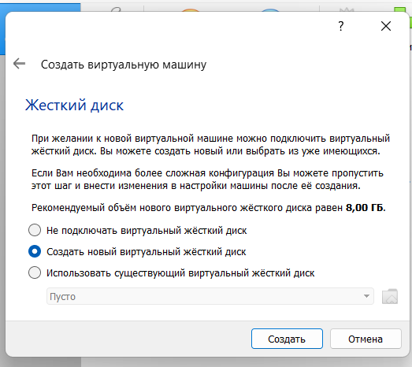
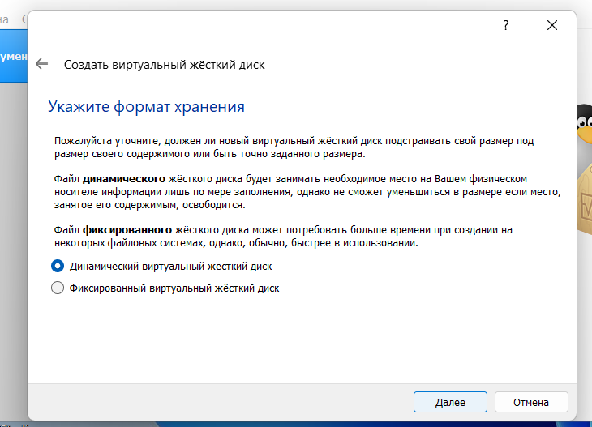
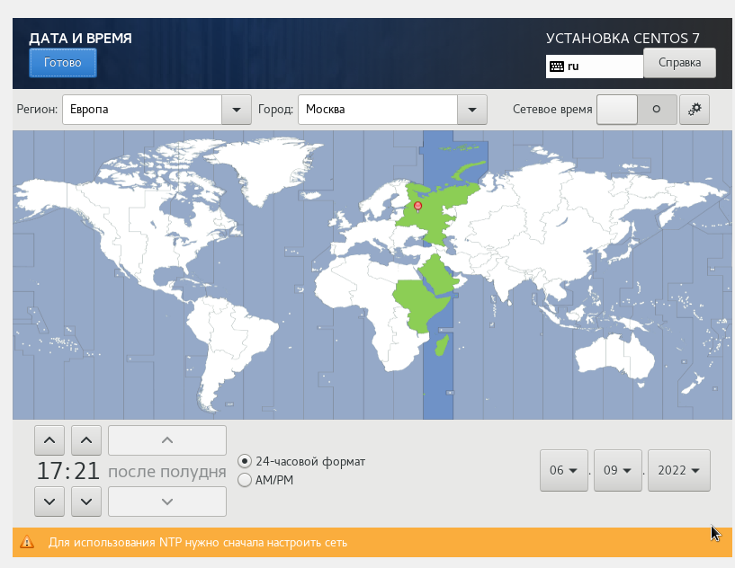
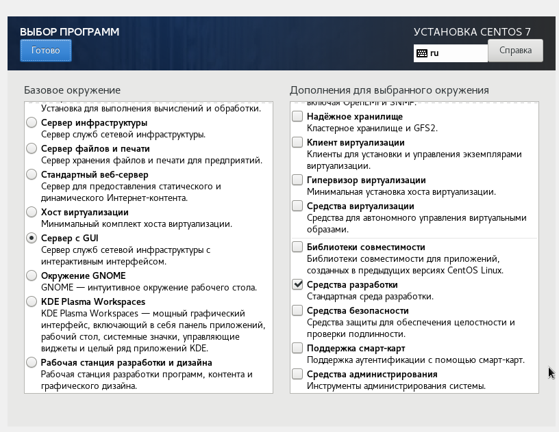
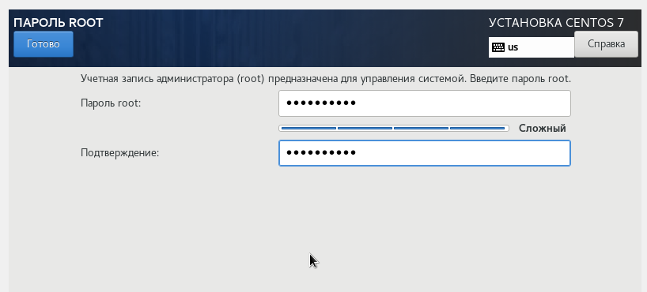
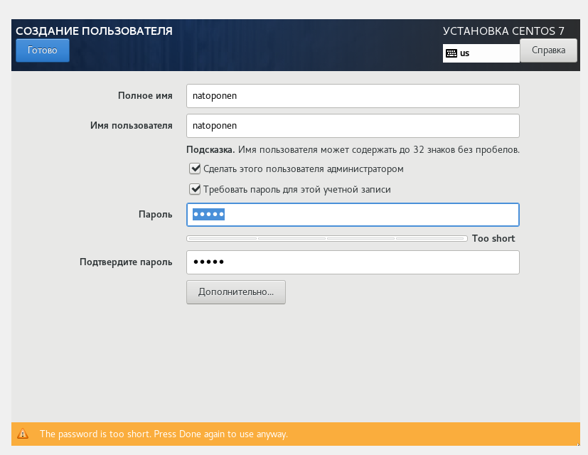
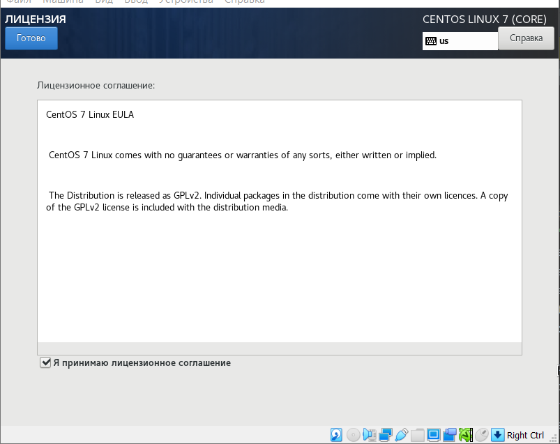

# Лабораторная работа №1
## Nikita A. Toponen
## RUDN University, 06 September 2022 Moscow, Russia

--- 

# Установка и конфигурицая ОС на виртуальную машину

---

### Цель выполнения работы

- Приобретение практических навыков установки операционной системы на виртуальную машину.

- Настройка минимально необходимого окружения для дальнейшей работы.

---

### Задачи работы

- Установить дистрибутив CentOS на виртуальную машину.

- Установить дополнения необходимые для дальнейшей работы.

---

# Выполнение работы

---

### Выполнение работы

#### Рис.1 Создание виртуальной машины

---

### Выполнение работы

#### Рис.2 Объем оперативной памяти

---

### Выполнение работы

#### Рис.3 Выбор виртуального жесткого диска

---

### Выполнение работы

#### Рис.4 Тип файла диска

---

### Выполнение работы

#### Рис.5 Формат хранения

---

### Выполнение работы

#### Рис.6 Выбор образа системы

---

### Выполнение работы

#### Рис.7 Начало установки

---

### Выполнение работы

#### Рис.8 Выбор часового пояса

---

### Выполнение работы

#### Рис.9 Выбор базового окружения

---

### Выполнение работы

#### Рис.10 Выключение KDUMP

---

### Выполнение работы

#### Рис.11 Подключение сети Ethernet

---

### Выполнение работы

#### Рис.12 Установление root пароля

---

### Выполнение работы

#### Рис.13 Создание пользователя с правами администартора

---

### Выполнение работы

#### Рис.14 Перезагрузка после установки

---

### Выполнение работы

#### Рис.15 Принятие лицензии

---

### Выполнение работы

#### Рис.16 Рабочий стол

---

### Выполнение работы

#### Рис.17 Подключение образа гостевой ОС

---

### Выполнение работы

#### Рис.18 Вывод команды dmesg

---

### Выполнение работы

#### Рис.19 Домашнее задание

---

### Выводы

В ходе выполнения данной лабораторной работы я:

- Приобрел практические навыки установки операционной системы CentOS на виртуальную машину.

- Настроил минимально необходимое окружения для дальнейшей работы.

---

# Спасибо за внимание!
