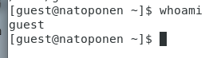
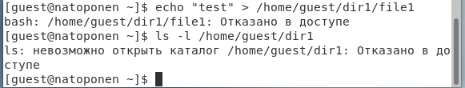

# Лабораторная работа №2
## Nikita A. Toponen
## RUDN University, 12 September 2022 Moscow, Russia

--- 

# Дискреционное разграничение прав в Linux

---

### Цель выполнения работы

- Получение практических навыков работы в консоли с атрибутами файлов.

- Закрепление теоретических основ дискреционного разграничения доступа в современных системах с открытым кодом на базе ОС Linux

---

# Выполнение работы

---

### Выполнение работы

#### Рис.1 Создание пользователя guest

---

### Выполнение работы

#### Рис.2 Установка пароля для guest

---

### Выполнение работы

#### Рис.3 Вход в систему под guest

---

### Выполнение работы

#### Рис.4 Домашняя директория

---

### Выполнение работы

#### Рис.5 Определение пользователя

---

### Выполнение работы

#### Рис.6 Имя пользователя, группа, а также группы, куда входит пользователь

---

### Выполнение работы

#### Рис.7 Группы пользователя

---

### Выполнение работы

#### Рис.8 guest в etc/passwd

---

### Выполнение работы

#### Рис.9 Существующие в системе директории

---

### Выполнение работы

#### Рис.10 Расширенные атрибуты

---

### Выполнение работы

#### Рис.11 Права доступа к новому файлу

---

### Выполнение работы

#### Рис.12 Изменение аттрибутов

---

### Выполнение работы

#### Рис.13 Запись в файл без прав

---

### Выполнение работы

#### Рис.14 Минимально необходимые права для выполнения операций внутри директории dir1

---

### Выводы

В ходе выполнения данной лабораторной работы я:

- Полученил практические навыки работы в консоли с атрибутами файлов.

- На практике закрепил теоретические основы дискреционного разграничения доступа в современных системах с открытым кодом на базе ОС Linux
---

# Спасибо за внимание!
