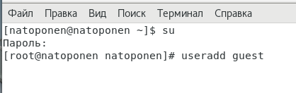
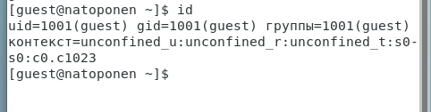
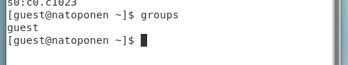
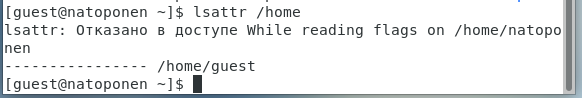
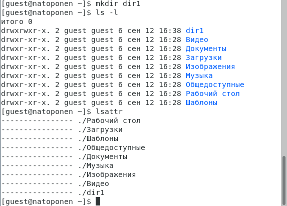
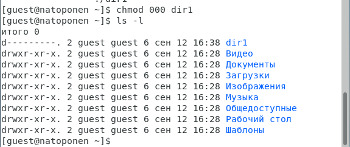
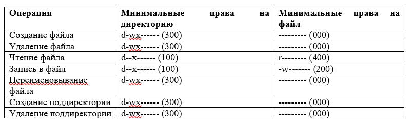

---
# Front matter
lang: ru-Ru
title: "Лабораторная работа №2"
subtitle: "Дискреционное разграничение прав в Linux"
author: "Топонен Никита Андреевич"

# Formatting
toc-title: "Содержание"
toc: true # Table of contents
toc_depth: 2
lof: true # List of figures
lot: true # List of tables
fontsize: 12pt
linestretch: 1.5
papersize: a4paper
documentclass: scrreprt
polyglossia-lang: russian
polyglossia-otherlangs: english
mainfont: PT Serif
romanfont: PT Serif
sansfont: PT Sans
monofont: PT Mono
mainfontoptions: Ligatures=TeX
romanfontoptions: Ligatures=TeX
sansfontoptions: Ligatures=TeX,Scale=MatchLowercase
monofontoptions: Scale=MatchLowercase
indent: true
pdf-engine: xelatex
header-includes:
  - \linepenalty=10 # the penalty added to the badness of each line within a paragraph (no associated penalty node) Increasing the value makes tex try to have fewer lines in the paragraph.
  - \interlinepenalty=0 # value of the penalty (node) added after each line of a paragraph.
  - \hyphenpenalty=50 # the penalty for line breaking at an automatically inserted hyphen
  - \exhyphenpenalty=50 # the penalty for line breaking at an explicit hyphen
  - \binoppenalty=700 # the penalty for breaking a line at a binary operator
  - \relpenalty=500 # the penalty for breaking a line at a relation
  - \clubpenalty=150 # extra penalty for breaking after first line of a paragraph
  - \widowpenalty=150 # extra penalty for breaking before last line of a paragraph
  - \displaywidowpenalty=50 # extra penalty for breaking before last line before a display math
  - \brokenpenalty=100 # extra penalty for page breaking after a hyphenated line
  - \predisplaypenalty=10000 # penalty for breaking before a display
  - \postdisplaypenalty=0 # penalty for breaking after a display
  - \floatingpenalty = 20000 # penalty for splitting an insertion (can only be split footnote in standard LaTeX)
  - \raggedbottom # or \flushbottom
  - \usepackage{float} # keep figures where there are in the text
  - \floatplacement{figure}{H} # keep figures where there are in the text
---

# Цель работы

Получение практических навыков работы в консоли с атрибутами файлов. Закрепление теоретических основ дискреционного разграничения доступа в современных системах с открытым кодом на базе ОС Linux на примерах.

# Задание

Выполнить задания из лабораторной работы и проанализировать полученные результаты.

# Теоретическое введение

Для выполнения данной лабораторной нет специальной теории. Необходимы общие знания в области компьютерных наук.

# Выполнение лабораторной работы

В установленной при выполнении предыдущей лабораторной работы операционной системе создал учётную запись пользователя guest (используя учётную запись администратора с правами root):

{#fig:001}

Задал пароль для пользователя guest (использую учётную запись администратора с правами root):

{#fig:002}

Вошел в систему от имени пользователя guest:

{#fig:003}

Определил директорию, в которой вы находитесь, командой *pwd*. Она является домашней для пользователя guest, что совпадает с приглашением командной строки:

{#fig:004}

Уточнил имя пользователя командой whoami:

{#fig:005}

Уточнил имя пользователя (1001(guest)), его группу (1001(guest)), а также группы, куда входит пользователь (1001(guest)), командой *id*, а также убедился в верности с помощью команды *groups*:

{#fig:006}

{#fig:007}

Просмотрел файл /etc/passwd командой *cat /etc/passwd* Найдите в нём свою учётную запись. Определил uid (1001) пользователя. Определите gid пользователя (1001). Что совпадает с информацией полученной выше:

{#fig:008}

Определил существующие в системе директории командой *ls -l /home/*:

{#fig:009}

Как видно на [рисунке](#fig:009) , только владельцы папок имеют полные права над директориями. Остальные атрибуты забраны.

Проверил, какие расширенные атрибуты установлены на поддиректориях, находящихся в директории /home, командой: *lsattr /home*:

{#fig:010}

Мне не удалось увидеть расширенные атрибуты как текущей директории, так и директории другого пользователя.

Создал в домашней директории поддиректорию dir1 командой *mkdir dir1*. Определил командами *ls -l* и *lsattr*, какие права доступа и расширенные атрибуты были выставлены на директорию dir1:

{#fig:011}

 У всех есть права на чтение и выполнение, но только у создателя и группы создателя есть права на запись. Расширенные атрибуты просмотреть не удалось.

Снял с директории dir1 все атрибуты командой *chmod 000 dir1* и проверил правильность выполнения с помощью команды *ls -l*:

{#fig:012}

Попытался создать в директории dir1 файл file1 командой *echo "test" > /home/guest/dir1/file1*. Но получил отказ, так как в предыдущем пункте забрал у себя все права к директории dir1. Соответственно данный файл не был создан. Попытался проверить это командой *ls -l /home/guest/dir1*, но также получил отказ из-за отсутствия прав:

{#fig:013}

Заполнил таблицу «Установленные права и разрешённые действия»:

{#fig:014}

{#fig:015}

{#fig:016}

{#fig:017}

{#fig:018}

{#fig:019}

На основании заполненной таблицы определил минимально необходимые права для выполнения операций внутри директории dir1:

{#fig:020}

# Выводы

В ходе выполнения данной лабораторной работы я приобрел практические навыки работы в консоли с атрибутами файлов, а также на практике закрепил теоретические основы дискреционного разграничения доступа в современных системах с открытым кодом на базе ОС Linux.

# Список литературы

- <code>[Кулябов Д. С., Королькова А. В., Геворкян М. Н Лабораторная работа №2](https://esystem.rudn.ru/pluginfile.php/1651747/mod_resource/content/6/002-lab_discret_attr.pdf)</code>