---
# Front matter
lang: ru-Ru
title: "Лабораторная работа №3"
subtitle: "Дискреционное разграничение прав в Linux. Два пользователя"
author: "Топонен Никита Андреевич"

# Formatting
toc-title: "Содержание"
toc: true # Table of contents
toc_depth: 2
lof: true # List of figures
lot: true # List of tables
fontsize: 12pt
linestretch: 1.5
papersize: a4paper
documentclass: scrreprt
polyglossia-lang: russian
polyglossia-otherlangs: english
mainfont: PT Serif
romanfont: PT Serif
sansfont: PT Sans
monofont: PT Mono
mainfontoptions: Ligatures=TeX
romanfontoptions: Ligatures=TeX
sansfontoptions: Ligatures=TeX,Scale=MatchLowercase
monofontoptions: Scale=MatchLowercase
indent: true
pdf-engine: xelatex
header-includes:
  - \linepenalty=10 # the penalty added to the badness of each line within a paragraph (no associated penalty node) Increasing the value makes tex try to have fewer lines in the paragraph.
  - \interlinepenalty=0 # value of the penalty (node) added after each line of a paragraph.
  - \hyphenpenalty=50 # the penalty for line breaking at an automatically inserted hyphen
  - \exhyphenpenalty=50 # the penalty for line breaking at an explicit hyphen
  - \binoppenalty=700 # the penalty for breaking a line at a binary operator
  - \relpenalty=500 # the penalty for breaking a line at a relation
  - \clubpenalty=150 # extra penalty for breaking after first line of a paragraph
  - \widowpenalty=150 # extra penalty for breaking before last line of a paragraph
  - \displaywidowpenalty=50 # extra penalty for breaking before last line before a display math
  - \brokenpenalty=100 # extra penalty for page breaking after a hyphenated line
  - \predisplaypenalty=10000 # penalty for breaking before a display
  - \postdisplaypenalty=0 # penalty for breaking after a display
  - \floatingpenalty = 20000 # penalty for splitting an insertion (can only be split footnote in standard LaTeX)
  - \raggedbottom # or \flushbottom
  - \usepackage{float} # keep figures where there are in the text
  - \floatplacement{figure}{H} # keep figures where there are in the text
---

# Цель работы

Получение практических навыков работы в консоли с атрибутами файлов для групп пользователей.

# Задание

Выполнить задания из лабораторной работы и проанализировать полученные результаты.

# Теоретическое введение

Для выполнения данной лабораторной нет специальной теории. Необходимы общие знания в области компьютерных наук.

# Выполнение лабораторной работы

В прошлой лабораторной работе был создан пользователь guest, а также задан пароль для него. Для этого, использую учетную запись администратора, были выполнены команды:
```shell
useradd guest

passwd guest
```

Провел аналогичную процедуры создания еще одного пользователя guest2:

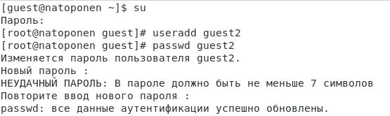{#fig:001}

Добавил пользователя guest2 в группу guest:

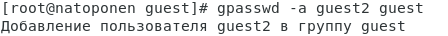{#fig:002}

Осуществил вход в систему от двух пользователей на двух разных консолях: guest на первой консоли и guest2 на второй консоли:

{#fig:003}

{#fig:004}

Для обоих пользователей командой *pwd* определил директорию, в которой они находятся. Вывод совпадает с приглашением командной строки. Оба пользователя находятся в домашней директории пользователя guest:

{#fig:005}

{#fig:006}

Уточнил имя пользователя, его группу, кто входит в неё и к каким группам принадлежит он сам:

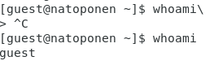{#fig:007}

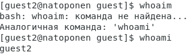{#fig:008}

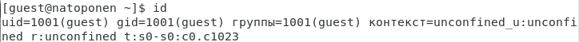{#fig:009}

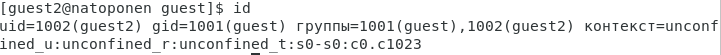{#fig:010}

Определил командами *groups guest* и *groups guest2*, в какие группы входят пользователи guest и guest2:

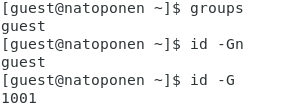{#fig:011}

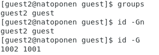{#fig:012}

Первая команда выводит на экран группы пользователя, но без уточнения к какому пользователю относятся группы, т.к. команды работаю только для пользователя, через которого открыта консоль. Вторая команда выводи код группы пользователя.

Сравнил полученную информацию с содержимым файла */etc/group*:

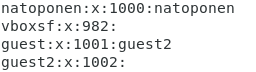{#fig:013}

Вывод команды совпадает с данными, полученными на предыдущих шагах.

От имени пользователя guest2 выполнил регистрацию пользователя guest2 в группе guest:

{#fig:014}

От имени пользователя guest изменил права директории */home/guest*, разрешив все действия для пользователей группы, а затем снял все атрибуты доступа с директории */home/guest/dir1*:

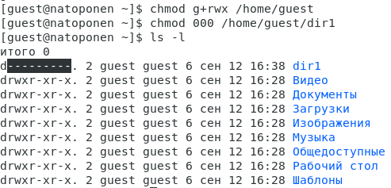{#fig:015}

Меняя атрибуты у директории *dir1* и файла *file1* от имени пользователя guest и делая проверку от пользователя guest2, заполнил таблицу ниже, определяя опытным путём, какие операции разрешены, а какие нет.

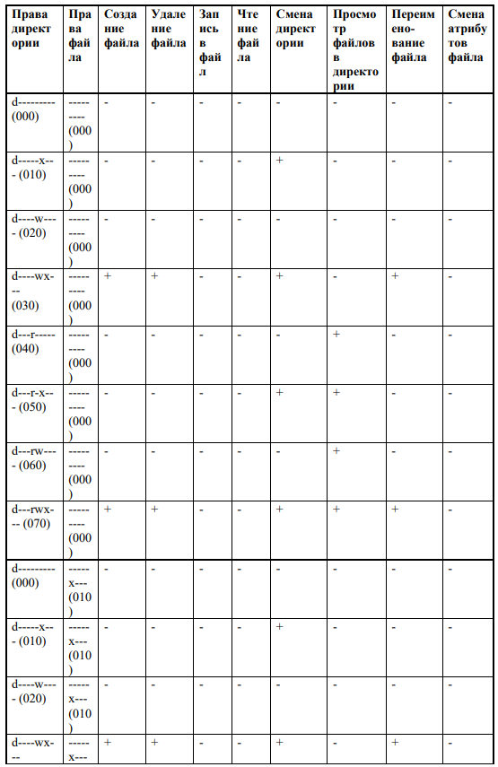{#fig:016}

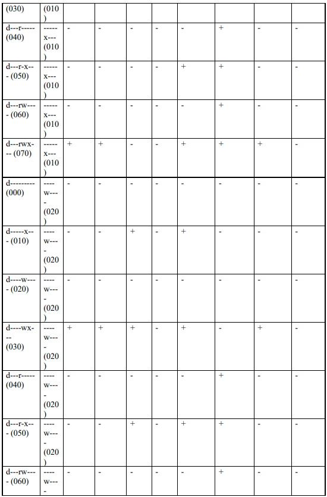{#fig:017}

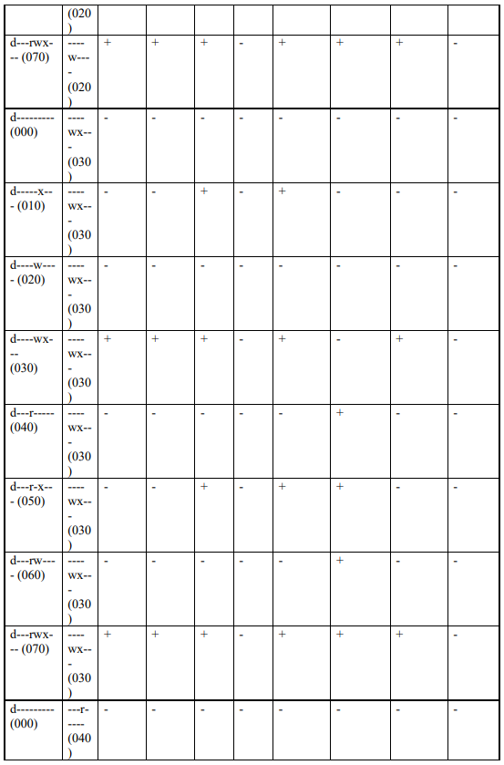{#fig:018}

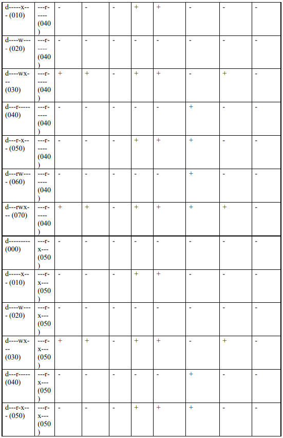{#fig:019}

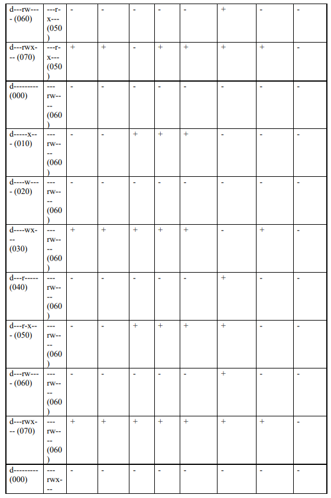{#fig:020}

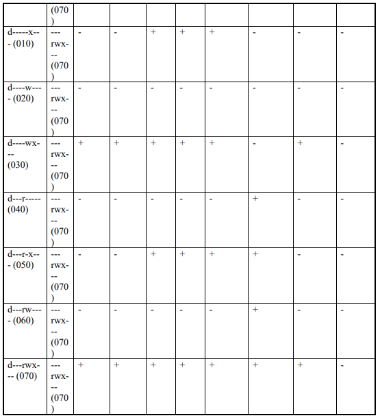{#fig:021}

Полученная таблица не совпадает с таблицей из прошлой лабораторной работы, поскольку члены группы не имеют права изменять атрибуты файла. Для остальных операций члену группы нужны такие же права, как у владельца.

На основании заполненной таблицы 3.1 определил те или иные минимально необходимые права для выполнения пользователем guest2 операций внутри директории dir1 и заполню таблицу:

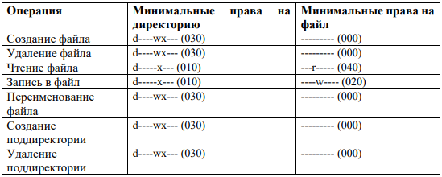{#fig:022}

# Выводы

В ходе выполнения данной лабораторной работы я приобрел практические навыки работы в консоли с атрибутами файлов для групп пользователей, а также на практике закрепил теоретические основы дискреционного разграничения доступа в современных системах с открытым кодом на базе ОС Linux.


# Список литературы

- <code>[Кулябов Д. С., Королькова А. В., Геворкян М. Н Лабораторная работа №3](https://esystem.rudn.ru/pluginfile.php/1651749/mod_resource/content/4/003-lab_discret_2users.pdf)</code>