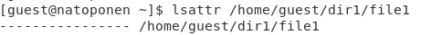
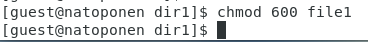
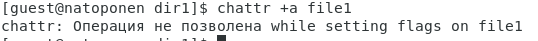
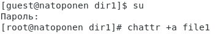
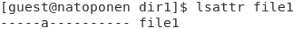
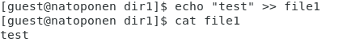
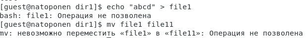
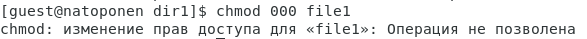
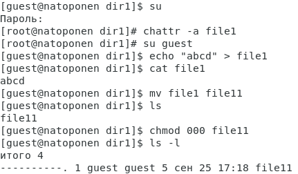
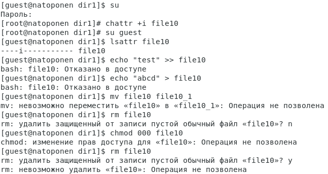

# Лабораторная работа №4
## Nikita A. Toponen
## RUDN University, 25 September 2022 Moscow, Russia

--- 

# Дискреционное разграничение прав в Linux. Расширенные атрибуты

---

### Цель выполнения работы

- Получение практических навыков работы в консоли с расширенными атрибутами файлов.

- Закрепление теоретических основ дискреционного разграничения доступа в современных системах с открытым кодом на базе ОС Linux.

---

# Выполнение работы

---

### Выполнение работы

#### Рис.1 Определение расширенных атрибутов файла file1

---

### Выполнение работы

#### Рис.2 Установление прав на файл file1

---

### Выполнение работы

#### Рис.3 Установление расширенных прав на файл file1 пользователем guest

---

### Выполнение работы

#### Рис.4 Установление расширенных прав на файл file1 суперпользователем

---

### Выполнение работы

#### Рис.5 Проверка расширенных прав на файл file1

---

### Выполнение работы

#### Рис.6 Выполнение дозаписи в файл с атрибутом a

---

### Выполнение работы

#### Рис.7 Удаление и перезапись файла с атрибутом a

---

### Выполнение работы

#### Рис.8 Изменения прав на файл с атрибутом a

---

### Выполнение работы

#### Рис.9 Повторение операций без атрибута a

---

### Выполнение работы

#### Рис.10 Повторение операций с атрибутом i

---

### Выводы

В ходе выполнения данной лабораторной работы я:

- Повысил свои навыки использования интерфейса командой строки (CLI)

- Познакомился на примерах с тем, как используются основные и расширенные атрибуты при разграничении доступа

- На практике закрепил теоретические основы дискреционного разграничения доступа в современных системах с открытым кодом на базе ОС Linux

---

# Спасибо за внимание!
