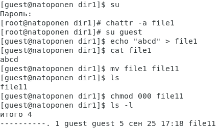
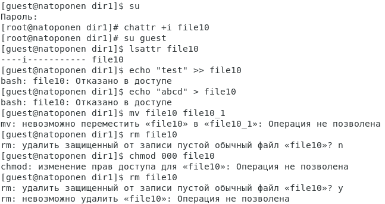

---
# Front matter
lang: ru-Ru
title: "Лабораторная работа №4"
subtitle: "Дискреционное разграничение прав в Linux. Расширенные атрибуты"
author: "Топонен Никита Андреевич"

# Formatting
toc-title: "Содержание"
toc: true # Table of contents
toc_depth: 2
lof: true # List of figures
lot: true # List of tables
fontsize: 12pt
linestretch: 1.5
papersize: a4paper
documentclass: scrreprt
polyglossia-lang: russian
polyglossia-otherlangs: english
mainfont: PT Serif
romanfont: PT Serif
sansfont: PT Sans
monofont: PT Mono
mainfontoptions: Ligatures=TeX
romanfontoptions: Ligatures=TeX
sansfontoptions: Ligatures=TeX,Scale=MatchLowercase
monofontoptions: Scale=MatchLowercase
indent: true
pdf-engine: xelatex
header-includes:
  - \linepenalty=10 # the penalty added to the badness of each line within a paragraph (no associated penalty node) Increasing the value makes tex try to have fewer lines in the paragraph.
  - \interlinepenalty=0 # value of the penalty (node) added after each line of a paragraph.
  - \hyphenpenalty=50 # the penalty for line breaking at an automatically inserted hyphen
  - \exhyphenpenalty=50 # the penalty for line breaking at an explicit hyphen
  - \binoppenalty=700 # the penalty for breaking a line at a binary operator
  - \relpenalty=500 # the penalty for breaking a line at a relation
  - \clubpenalty=150 # extra penalty for breaking after first line of a paragraph
  - \widowpenalty=150 # extra penalty for breaking before last line of a paragraph
  - \displaywidowpenalty=50 # extra penalty for breaking before last line before a display math
  - \brokenpenalty=100 # extra penalty for page breaking after a hyphenated line
  - \predisplaypenalty=10000 # penalty for breaking before a display
  - \postdisplaypenalty=0 # penalty for breaking after a display
  - \floatingpenalty = 20000 # penalty for splitting an insertion (can only be split footnote in standard LaTeX)
  - \raggedbottom # or \flushbottom
  - \usepackage{float} # keep figures where there are in the text
  - \floatplacement{figure}{H} # keep figures where there are in the text
---

# Цель работы

Получение практических навыков работы в консоли с расширенными атрибутами файлов.

# Задание

Выполнить задания из лабораторной работы и проанализировать полученные результаты.

# Теоретическое введение

Для выполнения данной лабораторной нет специальной теории. Необходимы общие знания в области компьютерных наук.

# Выполнение лабораторной работы

От имени пользователя guest определил расширенные атрибуты файла */home/guest/dir1/file1* командой

```bash
lsattr /home/guest/dir1/file1
```

{#fig:001}

Установил командой

```bash
chmod 600 file1
```

на файл *file1* права, разрешающие чтение и запись для владельца файла.

{#fig:002}

Попробовал установить на файл */home/guest/dir1/file1* расширенный атрибут **a** от имени пользователя guest: 

```bash
chattr +a /home/guest/dir1/file1 
```

В ответ получил отказ от выполнения операции.

{#fig:003}

Повысил свои права с помощью команды *su*. Попробовал установить расширенный атрибут **a** на файл */home/guest/dir1/file1* от имени суперпользователя: 

```bash
chattr +a /home/guest/dir1/file1
```

{#fig:004}

От пользователя guest проверил правильность установления атрибута: 

```bash
lsattr /home/guest/dir1/file1
```

{#fig:005}

Выполнил дозапись в файл file1 слова «test» командой 

```bash
echo "test" /home/guest/dir1/file1
```

 После этого выполните чтение файла file1 командой 

```bash
cat /home/guest/dir1/file1
```

{#fig:006}

Дозапись прошла успешно.

Попробовал стереть имеющуюся в файле информацию командой 

```bash
echo "abcd" > /home/guest/dirl/file1
```

Затем попробовал переименовать файл:

```bash
mv file1 file11
```

{#fig:007}

Попробовал с помощью команды

```bash
chmod 000 file1
```

установить на файл file1 права, запрещающие чтение и запись для владельца файла. Данная операция над файлом не позволена?

{#fig:008}

Снял расширенный атрибут **a** с файла */home/guest/dirl/file1* от имени суперпользователя командой

```bash
chattr -a /home/guest/dir1/file1
```

Повторил операции, которые ранее не удавалось выполнить.

{#fig:009}

После выполнения пришел к выводу, что атрибут **а** позволяет добавлять информацию в файл, но удалять ее, переименовывать файл или менять права доступа к нему нельзя. Атрибут может быть установлен только суперпользователем.

Повторил те же действия по шагам для файла file10, заменив атрибут **a** атрибутом **i**.

{#fig:010}

После выполнения пришел к выводу, что атрибут **i** указывает на то, что нельзя изменять название файла, его содержимое и права доступа. Атрибут может быть установлен только суперпользователем.

# Выводы

В результате выполнения работы я повысил свои навыки использования интерфейса командой строки (CLI), познакомился на примерах с тем, как используются основные и расширенные атрибуты при разграничении доступа. Имел возможность связать теорию дискреционного разделения доступа (дискреционная политика безопасности) с её реализацией на практике в ОС Linux. Составил наглядные таблицы, поясняющие какие операции возможны при тех или иных установленных правах. Опробовал действие на практике расширенных атрибутов **а** и **i**.


# Список литературы

- <code>[Кулябов Д. С., Королькова А. В., Геворкян М. Н Лабораторная работа №4](https://esystem.rudn.ru/pluginfile.php/1651751/mod_resource/content/3/004-lab_discret_extattr.pdf)</code>