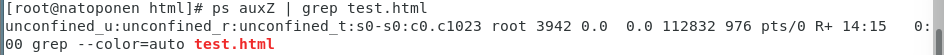
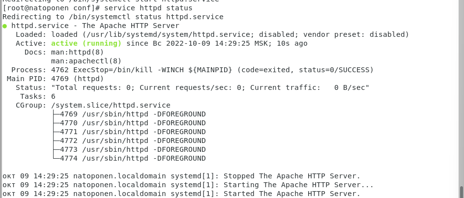

<style>
section::after {
  content: attr(data-marpit-pagination) ' / ' attr(data-marpit-pagination-total);
}
img[alt="center"] {
     display: block;
     margin: 0 auto;
}
h1 {
    font-size: 60px;
    text-align: center;
}
h2 {
    font-size: 30px;
    text-align: left;
    position: relative;
    left: -2em;
    line-height: 0px;
    top: 8em;
}
h3 {
    font-size: 40px;
    text-align: left;
    position: relative;
    left: -0.5em;
    bottom: 0.2em;
}
h4 {
    font-size: 25px;
    text-align: center;
    position: relative;
    left: -0.5em;
    bottom: 0.2em;
}
</style>

# Лабораторная работа №6
## Nikita A. Toponen
## RUDN University, 9 October 2022 Moscow, Russia

--- 

# Мандатное разграничение прав в Linux

---

### Цель выполнения работы

- Развить навыки администрирования ОС Linux

- Получить первое практическое знакомство с технологией SELinux

- Проверить работу SELinx на практике совместно с веб-сервером Apache

---

# Выполнение работы

---

### Выполнение работы


#### Рис.1 Режим и политика SELinux

---

### Выполнение работы


#### Рис.2 Запуск Apache web server

---

### Выполнение работы


#### Рис.3 Контекст безопасности Apache web server

---

### Выполнение работы


#### Рис.4 Текущее состояние переключателей SELinux для Apache

---

### Выполнение работы


#### Рис.5 Тип файлов и поддиректорий

---

### Выполнение работы


#### Рис.6 Создание файла test.html

---

### Выполнение работы

``` html
<html>
<body>test</body>
</html>
```
#### Текст файла test.html

---

### Выполнение работы


#### Рис.7 Контекст файла test.html

---

### Выполнение работы


#### Рис.8 Веб страница

---

### Выполнение работы


#### Рис.9 Контекст файла test.html

---

### Выполнение работы


#### Рис.10 Изменения контекста файла test.html

---

### Выполнение работы


#### Рис.11 Доступ к странице запрещен

---

### Выполнение работы


#### Рис.12 Логи веб сервера

---

### Выполнение работы


#### Рис.13 Audit логи

---

### Выполнение работы


#### Рис.14 Смена порта

---

### Выполнение работы


#### Рис.15 Запуск на 81 порту

---

### Выполнение работы


#### Рис.16 Установление порта

---

### Выполнение работы


#### Рис.17 Работа веб сервера на 81 порту

---

### Выполнение работы


#### Рис.18 Возвращение к 80 порту

---

### Выполнение работы


#### Рис.19 Удаление файла страницы

---

### Выполнение работы


#### Рис.20 Результат работы сервера после удаления

---

### Выводы

В ходе выполнения данной лабораторной работы я:

- Развил навыки администрирования ОС Linux

- Получил первое практическое знакомство с технологией SELinux

- Проверил работу SELinx на практике совместно с веб-сервером Apache

---

# Спасибо за внимание!
