---
# Front matter
lang: ru-Ru
title: "Лабораторная работа №6"
subtitle: "Мандатное разграничение прав в Linux"
author: "Топонен Никита Андреевич"

# Formatting
toc-title: "Содержание"
toc: true # Table of contents
toc_depth: 2
lof: true # List of figures
lot: true # List of tables
fontsize: 12pt
linestretch: 1.5
papersize: a4paper
documentclass: scrreprt
polyglossia-lang: russian
polyglossia-otherlangs: english
mainfont: PT Serif
romanfont: PT Serif
sansfont: PT Sans
monofont: PT Mono
mainfontoptions: Ligatures=TeX
romanfontoptions: Ligatures=TeX
sansfontoptions: Ligatures=TeX,Scale=MatchLowercase
monofontoptions: Scale=MatchLowercase
indent: true
pdf-engine: xelatex
header-includes:
  - \linepenalty=10 # the penalty added to the badness of each line within a paragraph (no associated penalty node) Increasing the value makes tex try to have fewer lines in the paragraph.
  - \interlinepenalty=0 # value of the penalty (node) added after each line of a paragraph.
  - \hyphenpenalty=50 # the penalty for line breaking at an automatically inserted hyphen
  - \exhyphenpenalty=50 # the penalty for line breaking at an explicit hyphen
  - \binoppenalty=700 # the penalty for breaking a line at a binary operator
  - \relpenalty=500 # the penalty for breaking a line at a relation
  - \clubpenalty=150 # extra penalty for breaking after first line of a paragraph
  - \widowpenalty=150 # extra penalty for breaking before last line of a paragraph
  - \displaywidowpenalty=50 # extra penalty for breaking before last line before a display math
  - \brokenpenalty=100 # extra penalty for page breaking after a hyphenated line
  - \predisplaypenalty=10000 # penalty for breaking before a display
  - \postdisplaypenalty=0 # penalty for breaking after a display
  - \floatingpenalty = 20000 # penalty for splitting an insertion (can only be split footnote in standard LaTeX)
  - \raggedbottom # or \flushbottom
  - \usepackage{float} # keep figures where there are in the text
  - \floatplacement{figure}{H} # keep figures where there are in the text
---

# Цель работы

1. Развить навыки администрирования ОС Linux. Получить первое практическое знакомство с технологией SELinux. 
2. Проверить работу SELinx на практике совместно с веб-сервером Apache.

# Задание

Выполнить задания из лабораторной работы и проанализировать полученные результаты.

# Теоретическое введение

Для выполнения данной лабораторной нет специальной теории. Необходимы общие знания в области компьютерных наук.

# Выполнение лабораторной работы

Войдите в систему с полученными учётными данными и убедитесь, что SELinux работает в режиме enforcing политики targeted с помощью команд getenforce и sestatus.

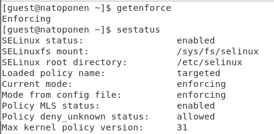{#fig:001}

Обратитесь с помощью браузера к веб-серверу, запущенному на вашем компьютере, и убедитесь, что последний работает: service httpd status или /etc/rc.d/init.d/httpd status Если не работает, запустите его так же, но с параметром start.

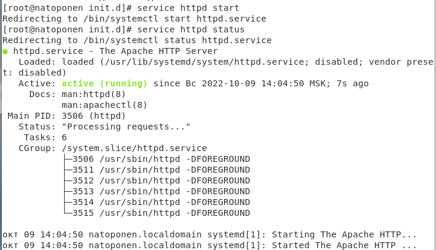{#fig:002}

Найдите веб-сервер Apache в списке процессов, определите его контекст безопасности и занесите эту информацию в отчёт. Например, можно использовать команду ps auxZ | grep httpd или ps -eZ | grep httpd

{#fig:003}

Посмотрите текущее состояние переключателей SELinux для Apache с помощью команды sestatus -bigrep httpd Обратите внимание, что многие из них находятся в положении «off»

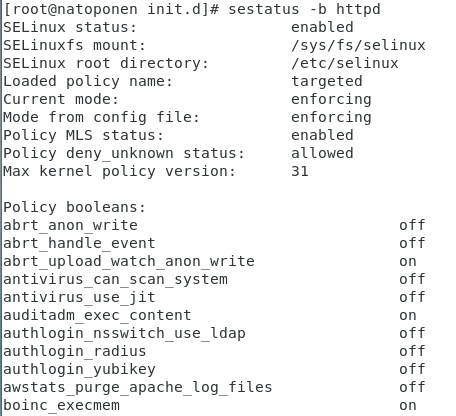{#fig:004}

Определите тип файлов и поддиректорий, находящихся в директории /var/www, с помощью команды ls -lZ /var/www

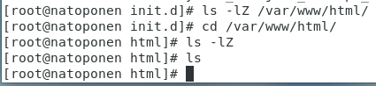{#fig:005}

Создайте от имени суперпользователя (так как в дистрибутиве после установки только ему разрешена запись в директорию) html-файл /var/www/html/test.html следующего содержания:

```html
<html>
<body>test</body>
</html>
```

{#fig:006}

Проверьте контекст созданного вами файла.

{#fig:007}

Обратитесь к файлу через веб-сервер, введя в браузере адрес http://127.0.0.1/test.html. Убедитесь, что файл был успешно отображён

{#fig:008}

Проверить контекст файла можно командой ls -Z. ls -Z /var/www/html/test.html

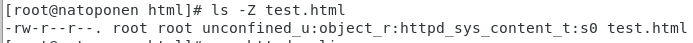{#fig:009}

Измените контекст файла /var/www/html/test.html с httpd_sys_content_t на любой другой, к которому процесс httpd не должен иметь доступа, например, на samba_share_t: chcon -t samba_share_t /var/www/html/test.html ls -Z /var/www/html/test.html

{#fig:010}

Попробуйте ещё раз получить доступ к файлу через веб-сервер, введя в браузере адрес http://127.0.0.1/test.html

{#fig:011}

Проанализируйте ситуацию. Почему файл не был отображён, если права доступа позволяют читать этот файл любому пользователю? ls -l /var/www/html/test.html Просмотрите log-файлы веб-сервера Apache. Также просмотрите системный лог-файл: tail /var/log/messages Если в системе окажутся запущенными процессы setroubleshootd и audtd, то вы также сможете увидеть ошибки, аналогичные указанным выше, в файле /var/log/audit/audit.log. Проверьте это утверждение самостоятельно.

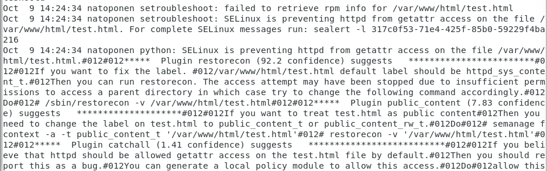{#fig:012}

{#fig:013}

Попробуйте запустить веб-сервер Apache на прослушивание ТСР-порта 81 (а не 80, как рекомендует IANA и прописано в /etc/services). Для этого в файле /etc/httpd/httpd.conf найдите строчку Listen 80 и замените её на Listen 81.

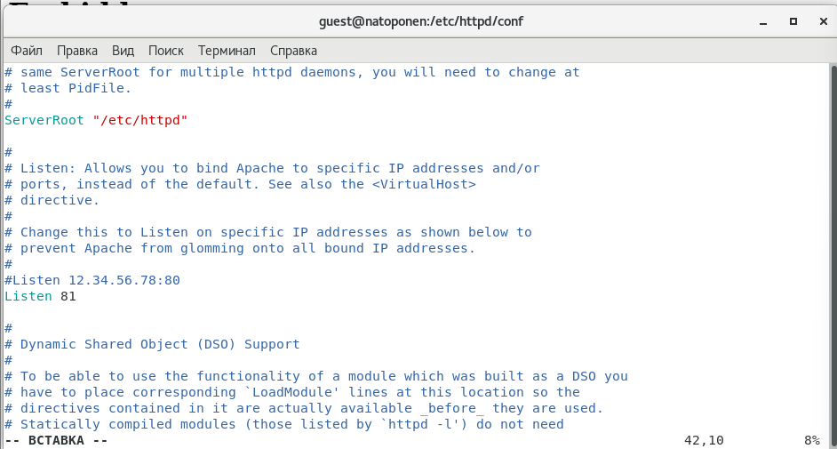{#fig:014}

{#fig:015}

Сервер успешно запустился на 81 порту.

Выполните команду semanage port -a -t http_port_t -р tcp 81 После этого проверьте список портов командой semanage port -l | grep http_port_t

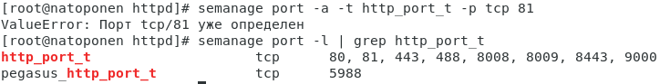{#fig:016}

Порт уже был определен.

Верните контекст httpd_sys_cоntent__t к файлу /var/www/html/ test.html: chcon -t httpd_sys_content_t /var/www/html/test.html После этого попробуйте получить доступ к файлу через веб-сервер, введя в браузере адрес http://127.0.0.1:81/test.html. Вы должны увидеть содержимое файла — слово «test».

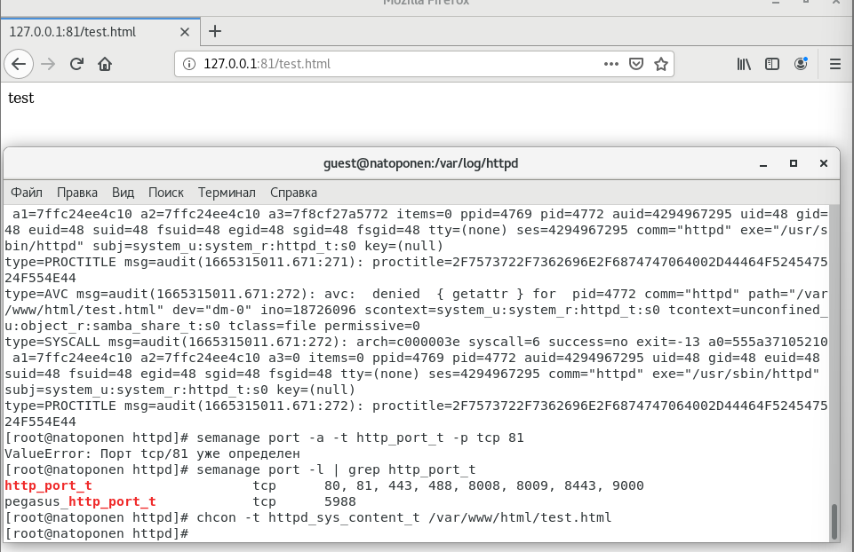{#fig:017}

Исправьте обратно конфигурационный файл apache, вернув Listen 80.

Удалите привязку http_port_t к 81 порту: semanage port -d -t http_port_t -p tcp 81 и проверьте, что порт 81 удалён.

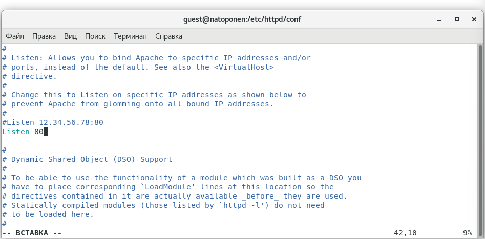{#fig:018}

Удалите файл /var/www/html/test.html: rm /var/www/html/test.html

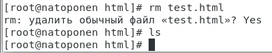{#fig:019}

{#fig:020}

# Выводы

В ходе данной лабораторной работы я развил навыки администрирования ОС Linux, получил первое практическое знакомство с технологией SELinux, проверил работу SELinx на практике совместно с веб-сервером Apache.


# Список литературы

- <code>[Кулябов Д. С., Королькова А. В., Геворкян М. Н Лабораторная работа №6](https://esystem.rudn.ru/pluginfile.php/1651755/mod_resource/content/2/006-lab_selinux.pdf)</code>