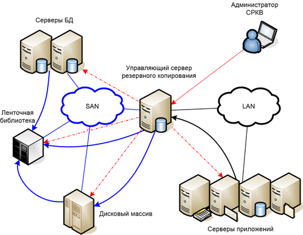
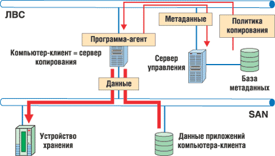
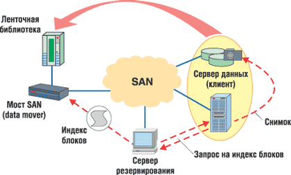
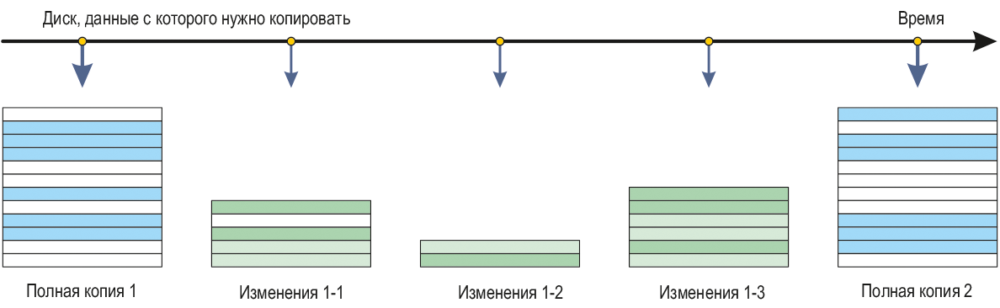
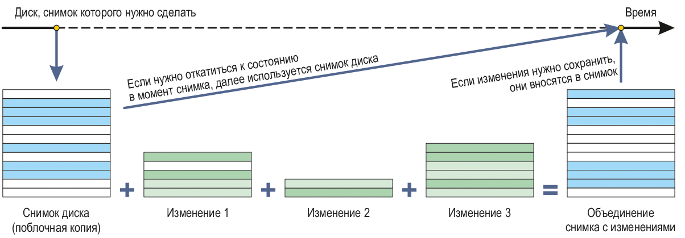

# Системы резервного копирования
## Nikita A. Toponen
## RUDN University, 27 September 2022 Moscow, Russia

--- 

### Определение

Система резервного копирования (СРК) определяется:
- Политикой резервного копирования.
- Регламентом резервного копирования, определяемого политикой.
- Инструментальной реализацией.

---

### Процесс резервного копирования
  
- Периодический запуск копирования.
- Запуск восстановления по требованию.
- Тестирование процесса копирования

---

### Архитектура и работа системы резервного копирования

#### Рис.1 Архитектура системы резервного копирования

---

### Классификация резервного копирования

По полноте сохраняемой информации
- Полное резервирование (Full backup)
- Добавочное резервирование (Incremental backup) 
- Разностное резервирование (Differential backup)
- Выборочное резервирование (Selective backup) 

По способу доступа к носителю
- Оперативное резервирование (Online backup)
- Автономное резервирование (Offline backup)

---

# Технологии резервного копирования

---

### Внесетевое копирование

#### Рис.2 Организация внесетевого копирования

---

### Внесерверное копирование

#### Рис.3 Организация внесерверного копирования

---

### Репликация

#### Рис.4 Организация внесерверного копирования

#### Рис.5 Организация внесерверного копирования

---

# Выводы

---

### Библиография

1. Медведовский И.Д., Семьянов П.В., Платонов В.В. Атака через Internet. — НПО "Мир и семья-95",  1997. — URL: http://bugtraq.ru/library/books/attack1/index.html
2. Медведовский И.Д., Семьянов П.В., Леонов Д.Г.  Атака на Internet. — Издательство ДМК, 1999. — URL: http://bugtraq.ru/library/books/attack/index.html
3. Запечников С. В. и др. Информационн~пасность открытых систем. Том 1. — М.: Горячаая линия -Телеком, 2006.
4. Статья в электронном журнале «Хабр»: «Система резервного копирования» https://habr.com/ru/post/421251/
5. Статья в электронном журнале TADVISER: «Система резервного копирования» https://www.tadviser.ru/index.php/Статья:Система_резервного_копирования

---

# Спасибо за внимание!